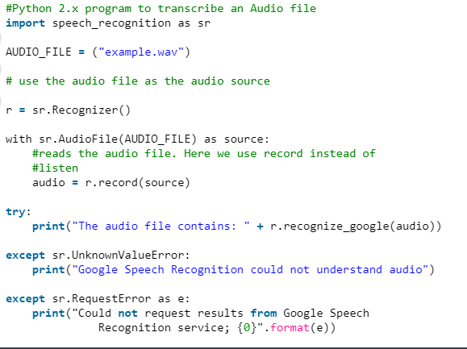

# Conversational Robot

Robotics Club Summer Project 2020

* Team Members:
  * [Abhay Dayal Mathur](https://github.com/Stellarator-X)
  * [Amitesh Singh Sisodia](https://github.com/Amitesh163)
  * [Anchal Gupta](https://github.com/anchalgupta05)
  * [Arpit Verma](https://github.com/Av-hash)
  * [Manit Ajmera](https://github.com/manitajmera)
  * [Sanskar Mittal](https://github.com/sanskarm)
  
***

## Aim

The aim of this project was to make a **Talking bot**, one which can pay attention to the user's voice and generate meaningful and contextual responses according to their intent, much like human conversations.

## Ideation

This project was divided into overall three parts :

* [Speech to Text conversion](https://github.com/Amitesh163/ConvBot_group/tree/master/SpeechRecognition)
* [Response Generation](https://github.com/Amitesh163/ConvBot_group/tree/master/Response%20Generation)
* [Text to speech conversion](https://github.com/Amitesh163/ConvBot_group/tree/master/TextToSpeech)

### Speech Recognition
In the speech recognition part , we used *google-speech-to-text (gstt)* API for the conversion of speech to text transcripts whose *WER is 4.7%*. 
A sample example of code is here:


### Response Generation
We used a subset of opensubtitles dataset to train our response generation model which was a joint combination of context based and topic based attention model.
This model has a encoder network which produces context vector for an input sentence followed by an attention mechanism which decides how much attention is to be paid to a particular word in a sentence and finally a decoder network which uses attention weights and context vectors to generate words of the output sentence i.e. response. We also added [aiml pipeline](https://github.com/Amitesh163/ConvBot_group/tree/master/ResponseGen%20%2B%20AIML/AIML%20files) to our model give response some specific pattern of inputs which include greeting , emotions, jokes , etc and also it gave our bot weather forecasting and googling ability to much extent.
Some of the output examples that we've produced with our model are:


### Text to speech conversion
We used the *google-text-to-speech (gtts)* API for the conversion of text transcripts of responses back to speech. Basically text transcripts are feed into this function as txt files , gtts creates mp3 file from those txt files and python *playsound* module is used to play the audio response from that mp3 file which is then removed so as to ensure long conversations may not end up using all memory.
A sample example of gTTS usage is here :


***

## Usage

Installing required dependencies : `$pip install requirements.txt`

Training checkpoints, LDA model weights and tokens can be found [here](https://drive.google.com/drive/folders/18o-bFpJjy1S4UHUbdTjQnb2B_IK4bIM5?usp=sharing)

Required File Structure:

```txt
ResponseGen + AIML
├── AIML files
│   └── ...
├── bot
│   ├── LDA
│   ├── Tokens.txt
│   ├── topic_dict.dict
│   └── training_checkpoints
└── ...
```

### Running the bot

```bash
usage: bot.py [-h] [-m {msg,trigger}]

The bot.

optional arguments:
  -h, --help            show this help message and exit
  -m {msg,trigger}, --mode {msg,trigger}
                        Mode of execution : Message box/ Trigger word
                        detection
```

#### Modes

* **Message Box** - Provides a GUI for the user to start the conversation at the click of a button.
* **Trigger Word Detection** - The program listens in the background and starts the conversation upon hearing the trigger word.
  * Commencement Trigger - _Hello_
  * Concluding Trigger - _Bye_

### Functionality

* Casual Conversations
* Google search along with an explicit search feature for images
* Weather Information

***

### Demonstration

The video demonstration of this project can be found [here](https://drive.google.com/file/d/1jAmxwfUnrx9qa9nh8Sol4ZByIH_w7YRE/view?usp=drivesdk).

***

## References

* _Deep Speech 2: End-to-End Speech Recognition in English and Mandarin_
  * **Link** : [https://arxiv.org/abs/1512.02595]
  * **Author(s)/Organization** : Baidu Research – Silicon Valley AI Lab
  * **Tags** : Speech Recognition
  * **Published** : 8 Dec, 2015

* _Topic Aware Neural Response Generation_
  * **Link** : [https://arxiv.org/abs/1606.08340]
  * **Authors** : Chen Xing, Wei Wu, Yu Wu, Jie Liu, Yalou Huang, Ming Zhou, Wei-Ying Ma
  * **Tags** : Neural response generation; Sequence to sequence model; Topic aware conversation model; Joint attention; Biased response generation
  * **Published** : 21 Jun 2016 (v1), 19 Sep 2016 (v2)

* _Topic Modelling and Event Identification from Twitter Textual Data_
  * **Link** : [https://arxiv.org/abs/1608.02519]
  * **Authors** : Marina Sokolova, Kanyi Huang, Stan Matwin, Joshua Ramisch, Vera Sazonova, Renee Black, Chris Orwa, Sidney Ochieng, Nanjira Sambuli
  * **Tags** : Latent Dirichlet Allocation; Topic Models; Statistical machine translation
  * **Published** : 8 Aug 2016

